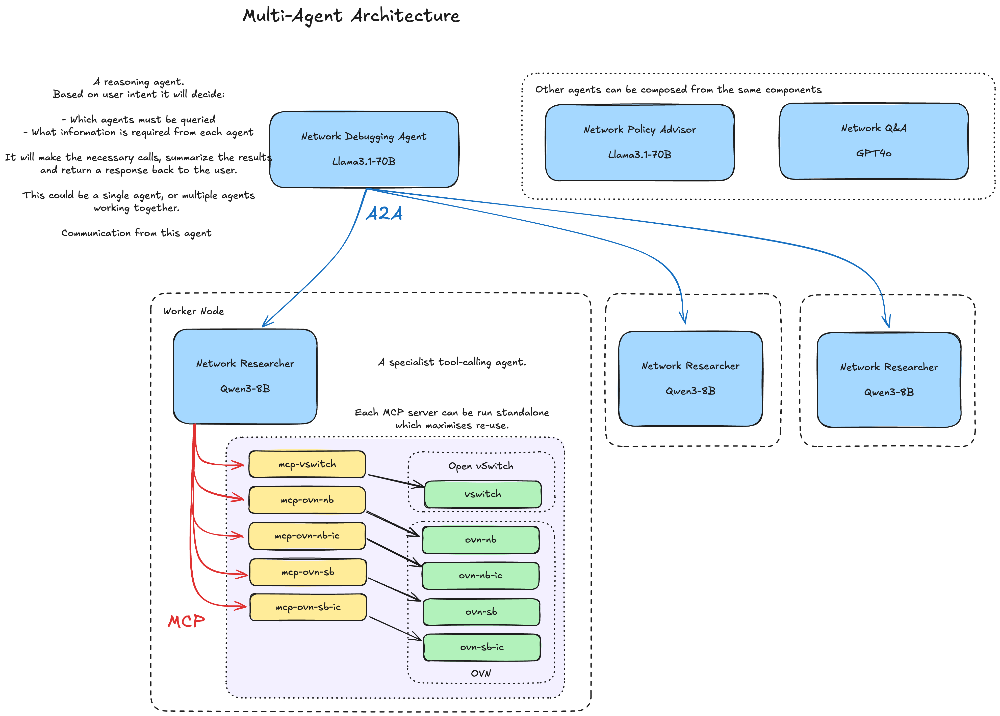

# Ariadne: Multi-Agent System for Network Analysis and Troubleshooting

This project is an experiment to demonstrate a multi-agent system for network
analysis and troubleshooting. Ariadne helped Theseus navigate the Labyrinth by
providing him with a thread to follow. The goal of this project is to provide
a thread to follow for network analysis and troubleshooting.


## 📊 **Architecture**



The architecture is based on the following components:

- **MCP Servers**: MCP servers for Open vSwitch (OVS) and OVN databases
- **AI Agents**: LangChain-powered AI agents using OpenAI-compatible models
   - **A2A Server**: Exposing lower-level agents to a higher-level agent

This has been designed to maximize re-use at every layer.
For example:

- **MCP Servers**: The MCP servers can be run anywhere, provided the OVSDB
  socket is available. This allows for packaging and deployment on standalone
  Linux systems, or in a container.

- **Research Agent**: The research agent is a lower-level agent that can use the
  MCP servers to discover the available tools.
  It could be used as a standalone agent in on a Linux system, or it can be
  composed with other agents to create a multi-agent system, for example if you
  are running in a Kubernetes cluster, you could have a research agent running
  on each node, and a higher-level agent that can use the research agents to
  analyze the network and troubleshoot issues.

- **A2A Protocol**: We rely on the Agent-to-Agent protocol to provide standards-based communication between agents.

- **TODO: Debugging Agent**: This agent would be built on top of one (or more) research agents.

## 🚀 **What's Included**

### **MCP Servers** (Go-based)
- **ovs-vswitch-mcp**: MCP server for Open vSwitch database
- **ovn-nbdb-mcp**: MCP server for OVN Northbound database  
- **ovn-sbdb-mcp**: MCP server for OVN Southbound database
- **ovn-ic-nbdb-mcp**: MCP server for OVN IC Northbound database
- **ovn-ic-sbdb-mcp**: MCP server for OVN IC Southbound database

### **AI Agent** (Python-based)
- **Network Researcher**: LangChain-powered AI agent using OpenAI-compatible models
- **(TODO) Network Debugger**: LangChain-powered AI agent using OpenAI-compatible models
## 🎯 **Key Benefits**

- **🔒 Flexible Deployment**: Use any OpenAI-compatible model server (local or remote)
- **💰 Cost Effective**: Use your own model server to control costs and experiment with different models
- **🌐 Network Flexible**: Works with local or remote model servers
- **🔧 Re-use**: Re-use the same MCP servers and AI agents to create a multi-agent system

## 📋 **Prerequisites**

### **Required**
- **Go 1.22+** (for MCP servers)
- **Python 3.10+** (for AI agent)
- **Docker** (for containerized deployment)
- **KIND** (Kubernetes in Docker) for local cluster
- **kubectl** for Kubernetes management
- **OVN-Kubernetes** checkout for KIND cluster setup
- **8GB+ RAM** (16GB+ recommended for optimal performance)
- **4+ CPU cores** (8+ recommended)
- **An OpenAI-compatible model server** (e.g., Ollama, vLLM, LM Studio)

## 🤖 **Model Setup**

The Network Researcher uses OpenAI-compatible models via a custom endpoint. You need to set up an OpenAI-compatible model server.

### **Model Server Options**

You can use any OpenAI-compatible model server:

- **Ollama** (recommended for local use)
- **vLLM** with OpenAI API compatibility
- **LM Studio** with OpenAI API compatibility
- **OpenAI API** (cloud-based)

### **Quick Setup with Ollama**

1. **Install Ollama:**
   ```bash
   curl -fsSL https://ollama.ai/install.sh | sh
   ```

2. **Pull a model:**
   ```bash
   ollama pull qwen3:8b
   ```

3. **Start Ollama server:**
   ```bash
   ollama serve
   ```

4. **Find your Ollama endpoint IP:**
   ```bash
   # Get your machine's IP address
   ip route get 1.1.1.1 | awk '{print $7; exit}'
   ```

5. **Update the kustomization.yaml file:**
   Edit `k8s/overlays/dev/kustomization.yaml` and update the IP address in the model endpoint URLs:
   ```yaml
   literals:
     - AGENT_MODEL_ENDPOINT_URL=http://YOUR_IP_ADDRESS:11434/v1
     - RESEARCHER_MODEL_ENDPOINT_URL=http://YOUR_IP_ADDRESS:11434/v1
   ```
## 🚀 **Quick Start**

### **Option 1: Complete System with KIND Cluster (Recommended)**

1. **Set up KIND cluster with OVN-Kubernetes:**
   ```bash
   # Clone OVN-Kubernetes repository
   git clone https://github.com/ovn-kubernetes/ovn-kubernetes.git
   cd ovn-kubernetes/contrib
   
   # Create KIND cluster with interconnect enabled
   ./kind.sh --enable-interconnect

   # Deploy a UDN

   
   # Return to the ariadne directory
   cd ../ariadne
   ```

3. **Set up your model server (e.g., Ollama):**
   ```bash
   # Install and start Ollama
   curl -fsSL https://ollama.ai/install.sh | sh
   ollama pull qwen3:8b
   ollama serve
   
   # Get your IP address and update kustomization.yaml
   YOUR_IP=$(ip route get 1.1.1.1 | awk '{print $7; exit}')
   sed -i "s/192.168.2.79/$YOUR_IP/g" k8s/overlays/dev/kustomization.yaml
   ```

   I have had good results running ollama on an M-series Mac, with the
   kind cluster running on an x86_64 machine. Just make sure that ollama
   is configured to bind to 0.0.0.0.

4. **Deploy the complete system:**
   ```bash
   make deploy
   ```

5. **For subsequent deployments (after code changes):**
   ```bash
   make redeploy
   ```

6. **Run the agent in interactive mode:**
   ```bash
   ./scripts/run_interactive.sh
   ```

   This will open a shell in the running agent pod, and you can start
   interacting with the agent. You can either type `test` to run a test
   command that asks to summarize the logical network configuration or you can
   chat with the agent directly. When finished, type `exit` to exit the shell.

### **Option 2: MCP Servers Only (Go-based)**

Note: This is not recommended unless you have access to a running OVS or OVN
process and the database sockets are available.

1. **Build and run MCP servers:**
   ```bash
   make build
   ```

2. **Start individual servers:**
   ```bash
   ./bin/ovs-vswitch-mcp -port 8080 &
   ./bin/ovn-nbdb-mcp -port 8081 &
   ./bin/ovn-sbdb-mcp -port 8082 &
   ./bin/ovn-ic-nbdb-mcp -port 8083 &
   ./bin/ovn-ic-sbdb-mcp -port 8084 &
   ```

### **Option 3: AI Agent Only (Python-based)**

1. **Install dependencies:**
   ```bash
   uv sync
   ```

2. **Run the agent (A2A server mode - default):**
   ```bash
   make run-agent
   ```

3. **Or run in interactive CLI mode:**
   ```bash
   make run-agent-interactive
   ```

4. **Or run manually:**
   ```bash
   # Set the model endpoint URL
   export RESEARCHER_MODEL_ENDPOINT_URL="http://localhost:11434/v1"
   
   # Then run the agent
   uv run network-researcher
   ```

## 🔧 **Configuration**

### **Makefile Targets**

The project includes a comprehensive Makefile for building and running the system:

```bash
# Show all available targets
make help

# Build all Go binaries
make build

# Build Docker images for MCP servers and agent
make docker-images

# Load Docker images into KIND cluster
make load-images

# Deploy to KIND cluster (first time)
make deploy

# Redeploy after changes (rebuilds images and updates deployment)
make redeploy

# Run tests
make test

# Run integration tests
make test-integration

# Clean build artifacts
make clean
```

## 🔧 **Development**

### **Building MCP Servers**

```bash
# Build everything (fetch schemas, generate models, build binaries)
make all

# Or build step by step:
make fetch-schemas    # Fetch OVSDB schemas from GitHub tagged versions
make generate-models  # Generate Go models from schemas
make build           # Build all MCP server binaries
```

### **Developing the AI Agent**

```bash
# Install development dependencies
uv sync --extra dev

# Run tests
uv run pytest

# Format code
uv run ruff format

# Type checking
uv run ruff check
```

## 🧪 **Testing**

```bash
# Test MCP servers
make test

# Test AI agent
uv run pytest
```
